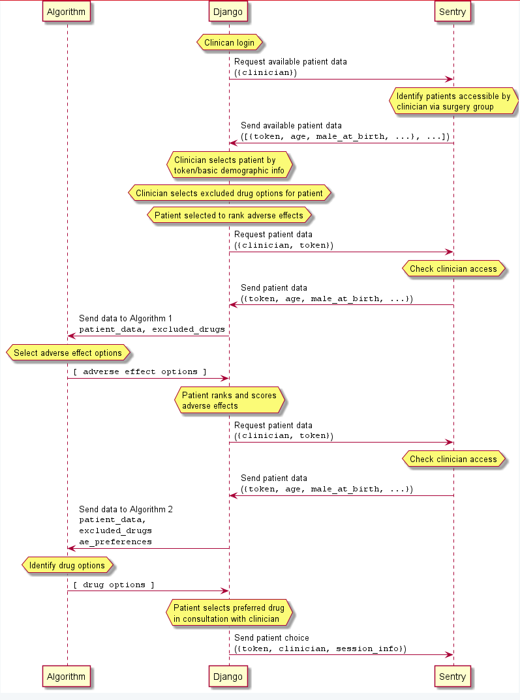

# PETRUSHKA shared variable specifications

## System components 

This is a list of the variables that are shared by two or more parts of the system. 
The parts of the system that have distinct data requirements are:
* `Sentry` -- the Sentry API gateway to the OpenClinica database
* `Django` -- the web front-end that faces the clinician and the patient and acts as a go-between for the `Sentry` and `Algorithm` components
* `Algorithm` -- the machine learning algorithm that helps clinicians match patients to drugs by adverse effect profile
  * `OBS` -- Subcomponent of the algorithm
  * `RCT` -- Subcomponent of the algorithm

### Workflow
```puml

participant Algorithm
participant Django
participant Sentry

hnote over Django : Clinican login

Django -> Sentry : Request available and active patient overviews\n(""{clinician}"")
hnote over Sentry : Identify patients accessible by\nclinician via surgery group
Sentry -> Django : Send available (basic demographic) patient data\n(""[{token, age, male_at_birth, ...}, ...]"")

hnote over Django : Clinician selects patient by\ntoken/basic demographic info
hnote over Django : Clinician selects excluded drug options for patient
hnote over Django : Patient selected to rank adverse effects

Django -> Sentry : Request patient data\n(""{clinician, token}"")
hnote over Sentry : Identify patient is accessible by\nclinician via surgery group
Sentry -> Django : Send patient data\n(""{token, age, male_at_birth, ...}"")

Django -> Algorithm : Send data to Algorithm 1\n""patient_data, excluded_drugs""
hnote over Algorithm : Select adverse effect options
Algorithm -> Django : ""[ adverse effect options ]""
hnote over Django : Patient ranks and scores\nadverse effects

Django -> Sentry : Request patient data\n(""{clinician, token}"")
hnote over Sentry : Identify patient is accessible by\nclinician via surgery group
Sentry -> Django : Send patient data\n(""{token, age, male_at_birth, ...}"")

Django -> Algorithm : Send data to Algorithm 2\n""patient_data,""\n""excluded_drugs""\n""ae_preferences""
hnote over Algorithm : Identify drug options 
Algorithm -> Django : ""[ drug options ]""
hnote over Django : Patient selects preferred drug\nin consultation with clinician

Django -> Sentry : Send patient choice\n(""{token, clinician, session_info}"")

```




### Interfaces

There are two key interfaces -- **Sentry**<-->**Django** and **Django**<-->**Algorithm**.
Data exchanged between **Sentry** and Django will be in **json** format. 
Data exchanged between Django and **Algorithm** will be in **python** format, either **dict** or a list of **dict**s -- keys will be the variable 
name and values the variable value.
The details of these requests are specified below the Variables list.

## Variables

**Version**: `0.1.1`

| Variable                                | Type        | Used by           | Description                                                                                                                 |
|-----------------------------------------|-------------|-------------------|-----------------------------------------------------------------------------------------------------------------------------|
| **token**                               | string      | Sentry, Django    | Patient unique identifier. In the form `^[PS][0-9]{4}$`                                                                     | 
| clinician                               | string      | Sentry, Django    | Username of the clinician to whom this patient is assigned                                                                  |
| male_at_birth                           | bool        | All               | Whether patient was assigned male at birth                                                                                  |
| age                                     | int         | All               | Patient age in years                                                                                                        |
| first_episode                           | bool        | Sentry, OBS       | Whether this is the patient's first episode of depression                                                                   |
| fluoxetine_history                      | bool        | Sentry, OBS       | Whether this patient has been prescribed fluoxetine before                                                                  |
| ssri_history                            | bool        | Sentry, OBS       | Whether this patient has been prescribed SSRIs before                                                                       |
| antidepressant_history                  | bool        | Sentry, OBS       | Whether this patient has been prescribed antidepressants before                                                             |
| bmi                                     | double      | Sentry, OBS       | Patient's body mass index (kg/m^2)                                                                                          |
| smoking_history                         | bool        | Sentry, OBS       | Whether patient has ever been a smoker                                                                                      |
| phq_9                                   | int         | Sentry, OBS       | Patient Health Questionnaire (PHQ-9) baseline depression severity score, 0-27                                               |
| psychotherapy_history                   | bool        | Sentry, OBS       | Whether this patient has previously had psychotherapy                                                                       |
| secondary_care_history                  | bool        | Sentry, OBS       | Whether this patient has previously been referred to secondary care                                                         |
| childhood_maltreatment_history          | bool        | Sentry, OBS       | Whether this patient has a history of child maltreatment                                                                    |
| coronary_heart_disease_comorbidity      | bool        | Sentry, OBS       | Whether this patient has comorbid coronary heart disease                                                                    |
| stroke_tia_comorbidity                  | bool        | Sentry, OBS       | Whether this patient has comorbid stroke or transient ischaemic attack                                                      |
| diabetes_comorbidity                    | bool        | Sentry, OBS       | Whether this patient has comorbid diabetes                                                                                  |
| epilepsy_seizure_comorbidity            | bool        | Sentry, OBS       | Whether this patient has comorbid epilepsy or seizures                                                                      |
| hypothyroidism_comorbidity              | bool        | Sentry, OBS       | Whether this patient has comorbid hypothyroidism                                                                            |
| chronic_inflamatory_disease_comorbidity | bool        | Sentry, OBS       | Whether this patient has comorbid chronic inflamatory disease                                                               |
| anxiety_ocd_comorbidity                 | bool        | Sentry, OBS       | Whether this patient has comorbid anxiety or Obsessive-compulsive disorder                                                  |
| migrane_comorbidity                     | bool        | Sentry, OBS       | Whether this patient has comorbid migrane                                                                                   |
| antihypertensive_drug_use               | bool        | Sentry, OBS       | Whether this patient is currently using antihypertensive drugs                                                              |
| asprin_use                              | bool        | Sentry, OBS       | Whether this patient is currently using asprin                                                                              |
| statins_use                             | bool        | Sentry, OBS       | Whether this patient is currently using statins                                                                             |
| non_steroidal_anti_inflamatory_drug_use | bool        | Sentry, OBS       | Whether this patient is currently using non-steroidal anti-inflamatory drugs                                                |
| anticoagulants_use                      | bool        | Sentry, OBS       | Whether this patient is currently using anti-coagulant drugs                                                                |
| anticonvulsant_use                      | bool        | Sentry, OBS       | Whether this patient is currently using anticonvulsant                                                                      |
| hypnotics_anxiolytics_use               | bool        | Sentry, OBS       | Whether this patient is currently using hypnotics or anxiolytics                                                            |
| bisphosphonates_use                     | bool        | Sentry, OBS       | Whether this patient is currently using bisphosphonates                                                                     |
| oral_contraceptive_hrt_use              | bool        | Sentry, OBS       | Whether this patient is currently using oral contraceptives or hormone replacement therapy                                  |
| ethnicity                               | bool        | Sentry, OBS       | Ethnicity (0 white/Caucasian, 1 African/Caribbean, 2 Asian, 3 Other), one-shot encoding                                     |
| townsend_quintile                       | bool        | Sentry, OBS       | Townsend quintile (from 1-least deprived to 5-most deprived), one-shot encoding                                             |
| hamd_3                                  | int         | Sentry, RCT       | Patient's score on Hamilton Depression Rating Scale - Question 3 (0-4)                                                      |
| hamd_4                                  | int         | Sentry, RCT       | Patient's score on Hamilton Depression Rating Scale - Question 4 (0-2)                                                      |
| hamd_6                                  | int         | Sentry, RCT       | Patient's score on Hamilton Depression Rating Scale - Question 6 (0-2)                                                      |
| hamd_10                                 | int         | Sentry, RCT       | Patient's score on Hamilton Depression Rating Scale - Question 10 (0-4)                                                     |
| hamd_11                                 | int         | Sentry, RCT       | Patient's score on Hamilton Depression Rating Scale - Question 11 (0-4)                                                     |
| hamd_13                                 | int         | Sentry, RCT       | Patient's score on Hamilton Depression Rating Scale - Question 13 (0-2)                                                     |
| hamd_17                                 | int         | Sentry, RCT       | Patient's score on Hamilton Depression Rating Scale - Question 17 (0-2)                                                     |
| hamd                                    | int         | Sentry, RCT       | Patient's total overall score on Hamilton Depression Rating Scale (0-52)                                                    |
| ae_probs                                | Array<Dict> | Django, Algorithm | Probabilities of adverse effects. Each probability represents an intersection between a drug and an adverse effect          |
| **preference**                          | Array<Dict> | Django, Algorithm | Patient's preferences for adverse effects. Each adverse effect is a dictionary with keys 'name', 'rank', and 'score'        |
| drug_options                            | Array<Dict> | Django, Algorithm | List of drug options to present to the patient. Each drug is presented as a dictionary with keys and values specified below |
| **drug_chosen**                         | string      | Django, Sentry    | Drug chosen by patient in consultation with clinician                                                                       |
 | petrushka_output                        | string      | Django, Sentry    | JSON string of all petrushka output                                                                                         |
 
**bold** names indicate variables that come from _users_. We should discuss a validation strategy for these variables -- who will validate them for security and how.
 
## Interchange formats

There are 9 interactions between components. 
The details for each of these requests are as follows:

### _Django_ Request available patient data _from Sentry_

```json5
{
  "authorisation": "string",  // Access token
  "action": "ptdata",         // Requested operation
  "clinician": "string"       // Clinician identifier
}
```

### _Sentry_ Send patient data _to Django_

```json5
[
  {
    "token": "string",            // Patient identifier
    "initials": "string",         // Patient initials
    "age": "int",                 // Patient age
    "male_at_birth": "boolean",   // Whether patient was assigned male at birth
    "time_created": "timestamp"   // When the patient OpenClinica record was created
  },
  // ... etc. for each patient accessible by clinician and not yet completed (i.e. no session data present)
]
```

### _Django_ Request specific patient data _from Sentry_

```json5
{
  "authorisation": "string",  // Access token
  "action": "ptdata",         // Requested operation
  "clinician": "string",      // Clinician identifier
  "token": "string"           // Patient identifier matching RegExpr ^[PS][0-9]{4}$
}
```

### _Sentry_ Send specific patient data _to Django_

```json5
{
  "token": "string",            // Patient identifier
  "initials": "string",         // Patient initials
  "age": "int",                 // Patient age
  "male_at_birth": "boolean",   // Whether patient was assigned male at birth
  "time_created": "timestamp"   // When the patient OpenClinica record was created
  // ...etc. for patient information keys listed in the Variables section
}
```

### _Django_ Send patient data _to Algorithm_

```python
patient_data = {
  "age": "int",                 # Patient age
  "male_at_birth": "boolean",   # Whether patient was assigned male at birth
  # ...etc. for patient information keys listed in the Variables section
}
excluded_drugs = [
  'Amitriptyline',
  'Escitalopram',
  # ...etc. for any other drugs excluded for patient by clinician
]
petrushka_backend.get_adverse_effect_options(patient_data, excluded_drugs)
```

### _Algorithm_ Send adverse effect options _to Django_

```python
# List of adverse effect names. Should be length 5, and the order is not important.
adverse_effect_options = [
  'Tremor', 
  'Pain', 
  'Visual disorder or impairment',
  # ... etc. for the other 2 adverse effect options
]
```

#### _Algorithm_: Adverse effect details

The Algorithm should also expose a dictionary of adverse effect details:

```python
petrushka_backend.adverse_effect_details = {
  'SE_1': {  # Adverse effect identifier
    'name': 'ae_1_name',  # Adverse effect display name
    'probs': (  # Tuple of low, high probabilities
      0.01, 
      0.10  
    ),
    'description': 'You probably don\t want this.'  # Description
  },    
  'SE_2': {
    'name': 'ae_2_name',
    'probs': (0.05, 0.25),
    'description': 'You probably don\t want this.'
  },
  # ...etc. for all adverse effects
}
```

### _Django_ Send adverse effect preferences _to Algorithm_

```python
preference = pandas.DataFrame(
  data={
    'Tremor': [90],
    'Pain': [73],
    # ... etc. for the other 3 adverse effects
  },
  index=['weight']
)
petrushka_backend.get_drug_options(patient_data, excluded_drugs, preference)
```

`patient_data` and `excluded_drugs` as defined in 
[Django Send patient data to Algorithm](#Django Send patient data to Algorithm).

### _Algorithm_ Send drug options _to Django_

```python
drug_options = pandas.DataFrame(
  data={
    'score': [0.92, 0.84, 0.77],
    'efficacy': [0.62, 0.22, 0.39],
    'acceptability': [0.22, 0.40, 0.13],
    'Tremor': [0.03, 0.07, 0.21],
    'Pain': [0.05, 0.01, 0.13],
    # ... etc. for the other 3 adverse effects
  },
  index=['Agomelatine', 'Amitriptyline', 'Escitalopram']  # Indexes are drug names
)
```

#### _Algorithm_: Drug details

The Algorithm should also expose a dictionary of drug details:

```python
petrushka_backend.drug_details = {
  'D_1': {  # Drug identifier
    'name': 'Agomelatine',  # Drug display name
    'url': 'https://link-to-offical.nhs/descrition',  # Link to details,
    'prescription': """
        Initially 15-30 mg daily for 2-4 weeks, dose to be taken at baseline,
        then adjusted according to response up to 45 mg once daily,
        alternatively up to 45 mg daily in 2 divided doses.
        """
  },    
  'D_2': {
    'name': 'Amitriptyline',
    'description': 'https://link-to-offical.nhs/descrition',
    'prescription': '...'  # Details of how drug is prescribed
  },
  # ...etc. for all drugs
}
```

### _Django_ Send patient choice _to Sentry_

```json5
{
  "authorisation": "string",      // Access token
  "action": "ptsession",          // Requested operation
  "clinician": "string",          // Clinician identifier
  "token": "string",              // Patient identifier matching RegExpr ^[PS][0-9]{4}$
  "session": {
    "drug_chosen": "string",      // Name of the drug chosen
    "petrushka_output": "string"  // JSON of all PETRUSHKA output
  }
}
```

## Updates

We all need to agree on this specification and be responsible for ensuring that our own components follow it.
It's entirely possible that the specification will need updating.
When updates are made, whoever makes the updates must notify the maintainers of other components that require updating as a result.
